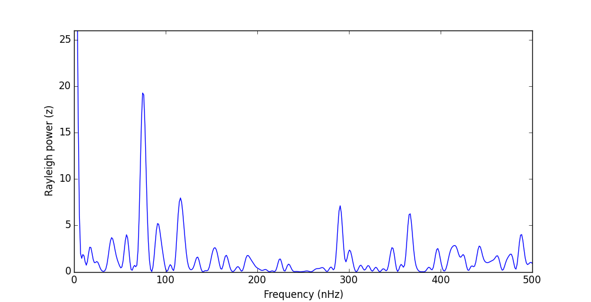

# Rayleigh Test and Power Spectrum

How do you determine periodicity of occurrence times for discrete events? The Rayleigh Power Spectrum (sometimes called a "Rayleigh analysis") has been used in solar physics studies to find periodic spacings between discrete events, such as flares.

For more examples of use check out [Droge et al. (1990)](http://adsabs.harvard.edu/abs/1990ApJS...73..279D). For discussion on the derivation and similarity to a maximum likelihood analysis using a sinusoidal distribution, see [Bai (1992)](http://adsabs.harvard.edu/doi/10.1086/171816).


## Example
Given a list of occurrence times for solar X-ray flare events from [Droge et al. (1990)](http://adsabs.harvard.edu/abs/1990ApJS...73..279D), search for any preferred period for these events to occur.

````python
from rayleigh import DrogeTest
DrogeTest()
````
The output of this example reproduces their Figure 2, and should look like this:



A periodicity of 153 days (75 nHz) is found.