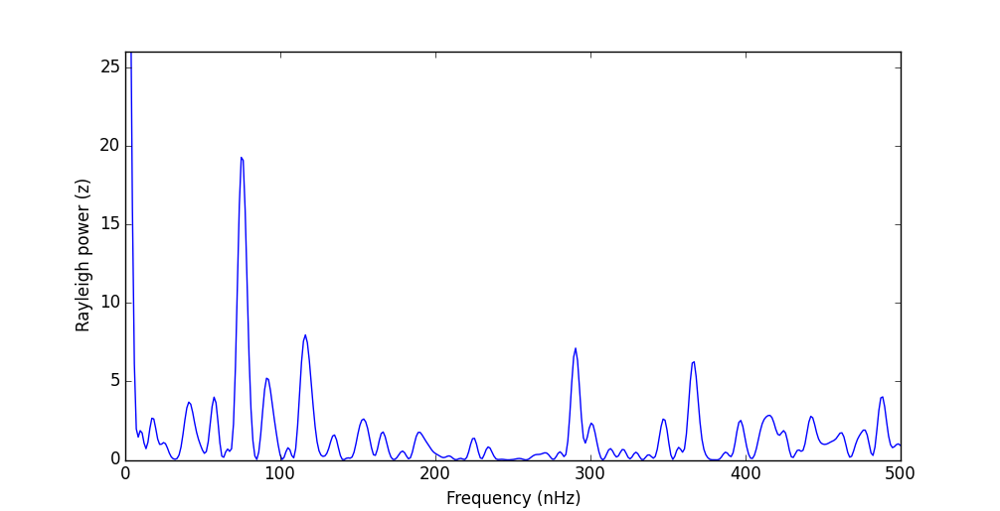
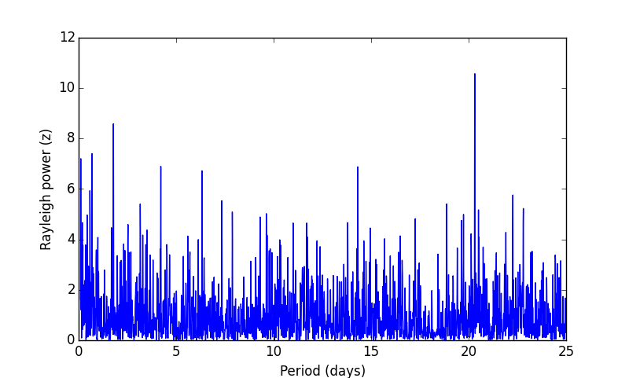

# Rayleigh Test and Power Spectrum

[](https://zenodo.org/badge/latestdoi/9547/jradavenport/rayleigh)

How do you determine periodicity of occurrence times for discrete events? The Rayleigh Power Spectrum (sometimes called a "Rayleigh analysis") has been used in solar physics studies to find periodic spacings between discrete events, such as flares.

For more examples of use check out [Droge et al. (1990)](http://adsabs.harvard.edu/abs/1990ApJS...73..279D). For discussion on the derivation and similarity to a maximum likelihood analysis using a sinusoidal distribution, see [Bai (1992)](http://adsabs.harvard.edu/doi/10.1086/171816).


## Examples
#### Solar Data
Given a list of occurrence times for solar X-ray flare events from [Droge et al. (1990)](http://adsabs.harvard.edu/abs/1990ApJS...73..279D), search for any preferred period for these events to occur. This example comes with the package, and can be run simply:

````python
from rayleigh import DrogeTest
DrogeTest()
````
The output of this example reproduces their Figure 2, and should look like this:



A periodicity of 153 days (75 nHz) is found. Note the power spectrum is presented here in *frequency* units (per Droge et al. 1990), while `Rayleigh` computes the power spectrum in units of *days* (see next exmaple).


#### Some Random Data
Here is the power spectrum for 1000 randomly spaced events over 100 days.

````python
import rayleigh
import matplotlib.pyplot as plt
import numpy as np

t = np.random.random(1000)*100.

ps = rayleigh.RayleighPowerSpectrum(t, minper=0.1, maxper=25, nper=2500)

plt.figure()
plt.plot(np.linspace(0.1, 25, 2500), ps)
plt.xlabel('Period (days)')
plt.ylabel('Rayleigh power (z)')
plt.show()
````
